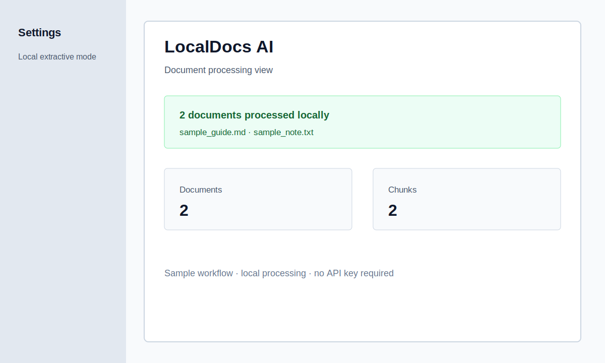
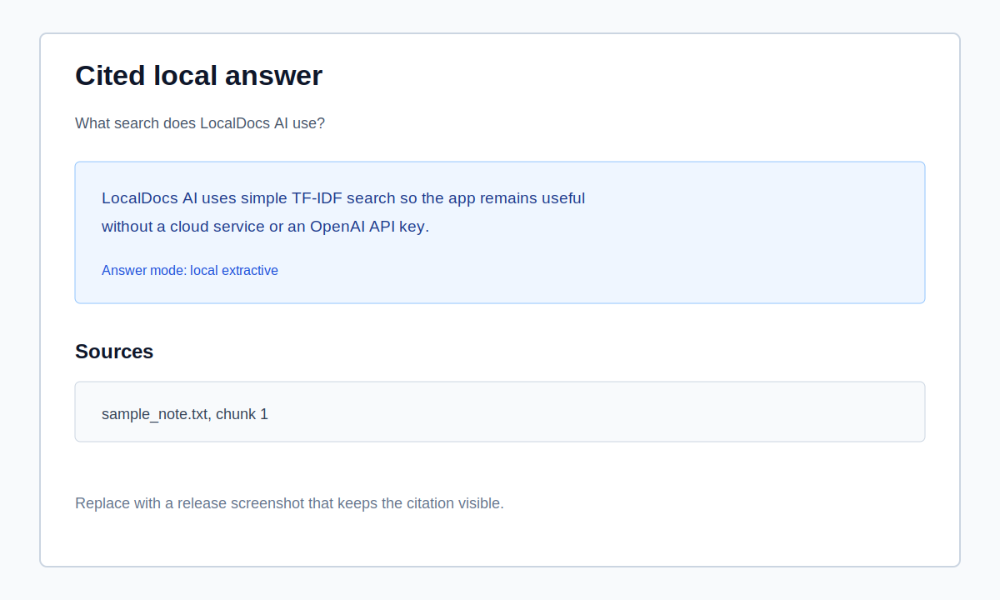

<div align="center">

# LocalDocs AI

**Private, cited document intelligence that runs locally by default.**

[](https://github.com/PatricioV1207/localdocs-ai/actions/workflows/tests.yml)
[](RELEASE_NOTES.md)
[](https://www.python.org/)
[](https://streamlit.io/)
[](LICENSE)
[](#local-first-by-default)

</div>

LocalDocs AI turns PDF, DOCX, TXT, and Markdown files into a private searchable
knowledge base with cited answers, summaries, study questions, flashcards, and
portable exports.

> **Project status:** v0.3.5 is a functional, contributor-friendly MVP. It is
> intentionally simple and does not aim to be a production multi-user platform.

## Local-First by Default

Many people have useful knowledge scattered across PDFs, notes, manuals, and guides. LocalDocs AI helps make those documents searchable and reusable while keeping the default workflow on your machine.

The app works without an OpenAI API key. OpenAI generation is disabled by default. If `OPENAI_API_KEY` is configured and the sidebar option is enabled, LocalDocs can optionally generate more natural answers and summaries, but answers are still based on retrieved document context.

## Interface Preview

| Document processing | Cited Q&A |
| --- | --- |
|  |  |

The previews use only repository sample content. Capture guidance for future
release screenshots lives in
[assets/screenshots/README.md](assets/screenshots/README.md).

## Features

- Parse PDF, DOCX, TXT, Markdown, and `.markdown` files.
- Chunk documents with `word`, `paragraph`, or Markdown `heading` strategies.
- Search locally with scikit-learn TF-IDF.
- Ask questions and get cited answers.
- Fall back to concise heuristic extractive answers without an API key.
- Generate basic summaries.
- Generate grammar-validated study questions and same-language flashcards with source references.
- Prefer fewer high-quality study items over filling the configured limit with weak content.
- Export summaries and Q&A history to Markdown.
- Export an Obsidian-friendly Markdown vault.
- Export Anki-compatible flashcards as TSV.
- Configure behavior with `localdocs_config.toml`.
- Run deterministic quality evaluations for QA, summaries, study tools, and source selection.

## Not Included

LocalDocs AI v0.3.5 intentionally does not include user accounts, authentication, cloud sync, OCR, audio transcription, image analysis, vector databases, desktop/mobile packaging, or multi-user collaboration.

## Supported Formats

- PDF files with extractable text
- DOCX files
- TXT files
- Markdown files (`.md` and `.markdown`)

PDF support means PDFs that already contain selectable text. Scanned PDFs and images need OCR, which is out of scope for v0.3.5.

## Quick Start

```bash
git clone https://github.com/PatricioV1207/localdocs-ai.git
cd localdocs-ai
python -m venv .venv
source .venv/bin/activate
pip install -r requirements.txt
streamlit run app.py
```

On Windows, activate the virtual environment with:

```bash
.venv\Scripts\activate
```

Then open the Streamlit URL printed in the terminal.

## 60-Second Demo

The repository includes safe sample files, so the complete local workflow can be
demonstrated without an API key or personal documents.

1. Start the app with `streamlit run app.py`.
2. Click **Process sample documents**.
3. Confirm that two documents and two chunks are shown.
4. Ask: **What search does LocalDocs AI use?**
5. Confirm that the answer mentions **TF-IDF search** and cites
   `sample_note.txt, chunk 1`.
6. Click **Generate summaries**, **Generate flashcards**, and
   **Generate study questions**.
7. Try the Markdown, Anki TSV, or Obsidian vault exports.

Expected demo properties:

- No `OPENAI_API_KEY` is required.
- Answers display their source references.
- Generated files stay under `exports/`, which is ignored except for
  `exports/.gitkeep`.
- Reprocessing documents clears outputs associated with the previous collection.

For a presentation checklist and speaking notes, see
[DEMO.md](DEMO.md).

## Configuration

LocalDocs AI reads `localdocs_config.toml` from the project root. If the file is missing or invalid, the app uses defaults and shows readable warnings in the sidebar.

```toml
[chunking]
strategy = "word"
chunk_size = 220
chunk_overlap = 40

[search]
top_k = 4
minimum_score = 0.05

[exports]
export_dir = "exports"

[llm]
use_openai_if_available = false

[study]
max_flashcards = 10
max_questions = 10

[obsidian]
vault_dir = "exports/obsidian_vault"

[anki]
flashcards_file = "exports/flashcards.tsv"
```

Chunking strategies:

- `word`: default behavior, split by word count.
- `paragraph`: group nearby paragraphs into chunks.
- `heading`: split Markdown by headings when possible, with paragraph fallback.

Chunk and search settings are available in the app sidebar under `Advanced settings`:

- `Chunking strategy`: chooses how parsed text is split before indexing.
- `Chunk size`: controls the approximate maximum words per chunk.
- `Chunk overlap`: repeats words between word-based chunks to preserve context.
- `Search results`: controls how many chunks are retrieved for a question.
- `Minimum search score`: filters weak matches before QA.

The defaults are intentionally conservative. Raise the minimum score for stricter answers, or lower it if useful evidence is being missed.

## Obsidian Export

Process documents, optionally generate summaries, flashcards, and study questions, then click `Export Obsidian vault`.

Default output:

```txt
exports/obsidian_vault/
├── 00_Index.md
├── Summaries.md
├── Questions.md
├── Flashcards.md
├── Sources.md
└── Documents/
```

Open that folder as a vault in Obsidian, or copy it into an existing vault. Obsidian is not required to create the export.

## Anki TSV Export

Generate flashcards, then click `Export Anki TSV`.

Default output:

```txt
exports/flashcards.tsv
```

Import the file into Anki as a tab-separated file and map the fields to question, answer, and source.

## Optional OpenAI Configuration

LocalDocs AI works without OpenAI.

To enable optional LLM-generated answers and summaries:

```bash
export OPENAI_API_KEY=your_api_key_here
```

Or create a local `.env` file:

```env
OPENAI_API_KEY=your_api_key_here
```

Do not commit `.env` files or API keys.

OpenAI API billing is separate from a ChatGPT subscription. Having ChatGPT access does not automatically provide API credits. If the API key is unavailable, invalid, rate-limited, or out of quota, LocalDocs shows a short friendly notice and continues with local extractive mode without exposing the raw API error.

## Development

Install dependencies:

```bash
pip install -r requirements.txt
```

Run tests:

```bash
python -m pytest
```

Running pytest as a Python module also ensures the repository package is importable consistently in local environments and GitHub Actions.

The equivalent direct command remains available when your shell is configured for it:

```bash
pytest
```

Run the deterministic quality gate:

```bash
python scripts/run_quality_eval.py
```

Compile all Python modules:

```bash
python -m compileall app.py localdocs tests scripts
```

GitHub Actions runs pytest, compileall, and the deterministic quality gate on
Python 3.11 and 3.12 for pushes and pull requests. It does not require
`OPENAI_API_KEY`.

Run the complete local validation sequence:

```bash
OPENAI_API_KEY="" python -m pytest
python -m compileall -q app.py localdocs tests scripts
OPENAI_API_KEY="" python scripts/run_quality_eval.py
```

## Quality Evaluation

[QUALITY_STANDARD.md](QUALITY_STANDARD.md) defines the hard gates for local QA,
summaries, study questions, flashcards, UI state, and source quality. The
evaluation system uses synthetic JSON chunks, so it does not require private
PDFs, network access, or an OpenAI API key.

```txt
evals/
├── fixtures/
└── expected/
```

Each fixture has a matching expected file. The runner checks grounding,
citations, required concepts, forbidden fragments, grammatical questions,
complete QA sentences, summary evidence, flashcard answer relevance, and
rejection of legal, index, contact, product, marketing, and broken-OCR sources.

See [PROGRESS.md](PROGRESS.md) for current status and
[DECISIONS.md](DECISIONS.md) for design decisions.

## Project Structure

```txt
localdocs-ai/
├── .github/
│   ├── ISSUE_TEMPLATE/
│   ├── workflows/
│   └── pull_request_template.md
├── assets/
│   └── screenshots/
├── localdocs/
│   ├── parser.py
│   ├── chunker.py
│   ├── cleaning.py
│   ├── concepts.py
│   ├── indexer.py
│   ├── search.py
│   ├── qa.py
│   ├── summarizer.py
│   ├── export.py
│   ├── flashcards.py
│   ├── study.py
│   ├── obsidian.py
│   └── config.py
├── evals/
│   ├── fixtures/
│   └── expected/
├── scripts/
│   └── run_quality_eval.py
├── sample_docs/
├── tests/
├── QUALITY_STANDARD.md
├── PROGRESS.md
├── DECISIONS.md
├── app.py
├── localdocs_config.toml
├── CONTRIBUTING.md
├── SECURITY.md
├── DEMO.md
├── RELEASE_NOTES.md
├── CHANGELOG.md
└── README.md
```

## Roadmap

Future work is tracked conservatively. Before proposing a large feature, read
the scope boundaries in [CONTRIBUTING.md](CONTRIBUTING.md) and open a focused
feature request.

## Current Limitations

- PDF parsing depends on extractable text.
- DOCX parsing reads normal paragraphs only; legacy `.doc` files are not supported.
- Search is keyword-oriented TF-IDF, not semantic search.
- Local answers select and join source sentences heuristically; they are not full abstractive summaries.
- Cleaning, grammatical validation, and concept extraction are heuristic and may still miss specialized terminology or unusual layouts.
- Strict quality filters can return fewer study questions or flashcards than the configured maximum.
- Spanish and English are the best-supported study-content languages; mixed-language documents can be inconsistent.
- Obsidian export is a Markdown folder export only.
- Anki export is TSV only.
- Streamlit session state is temporary.

## Contributing

Contributions are welcome. Read [CONTRIBUTING.md](CONTRIBUTING.md) before opening a pull request.

Please keep changes local-first, simple, and useful without requiring an API key.

Useful starting points:

- Improve deterministic fixtures for a concrete document-quality regression.
- Add parser and export edge-case tests.
- Improve documentation using public or synthetic examples.
- Pick an issue labeled `good first issue` once maintainers add one.

## Security

Please read [SECURITY.md](SECURITY.md) before reporting vulnerabilities. Do not post private documents, secrets, or API keys in public issues.

## License

LocalDocs AI is released under the MIT License. See [LICENSE](LICENSE).

## Release Notes

See [RELEASE_NOTES.md](RELEASE_NOTES.md) for the presentation-ready v0.3.5
summary and [CHANGELOG.md](CHANGELOG.md) for the full version history.
